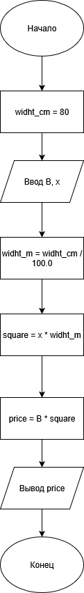

# Домашнее задание к лабораторной работе 2

## Условие задачи

В магазине продается костюмная ткань. Ее цена В рублей за кв. Метр. Напишите программу, которая подсчитает и выведет на экран стоимость куска этой ткани длиной х м и шириной 80 см.1. 


## 1. Алгоритм и блок-схема


### Алгоритм
1. **Начало**
2. Объявить константы:
    - `width_сm` = 80 (см) - Ширина ткани
3. Задать исходные данные:
    - `x` = 3 (м) - Длина куска ткани в метрах
    - `B` = 100 (руб) - Цена ткани (рублей за кв. метр)
4. Перевести ширину см в метры:
    - `width_m` = `width_cm` / 100.0
5. Вычислить площадь куска ткани:
    - `square` = `x` * `width_cm` 
6. Вычислить общую стоимость куска ткани:
    - `price` = `price_per_sqm` * `square`
7. Вывести результаты расчетов с подстановкой всех значений в текст.
8. **Конец**

### Блок-схема

## 2. Реализация программы
```
#include <stdio.h>
#include <locale.h>

int main()

{
	setlocale(LC_CTYPE, "RUS");
	int widht_cm = 80;
	int x = 3;
	int B = 100;
	float widht_m = widht_cm / 100.0;
	float square = x * widht_m;
	float price = B * square;

	printf("В магазине продается костюмная ткань. Ее цена %d рублей за кв. Метр. Напишите программу, которая подсчитает и выведет на экран стоимость куска этой ткани длиной %d м и шириной 80 см.1. Цена = %0.f рублей", B, x, price);
	return 0;
}
```
## 3. Результаты работы программы
В магазине продается костюмная ткань. Ее цена 100 рублей за кв. Метр. Напишите программу, которая подсчитает и выведет на экран стоимость куска этой ткани длиной 3 м и шириной 80 см.1. Цена = 240 рублей
[После запуска программы просто скопируйте вывод из консоли и вставьте его в этот раздел ]
